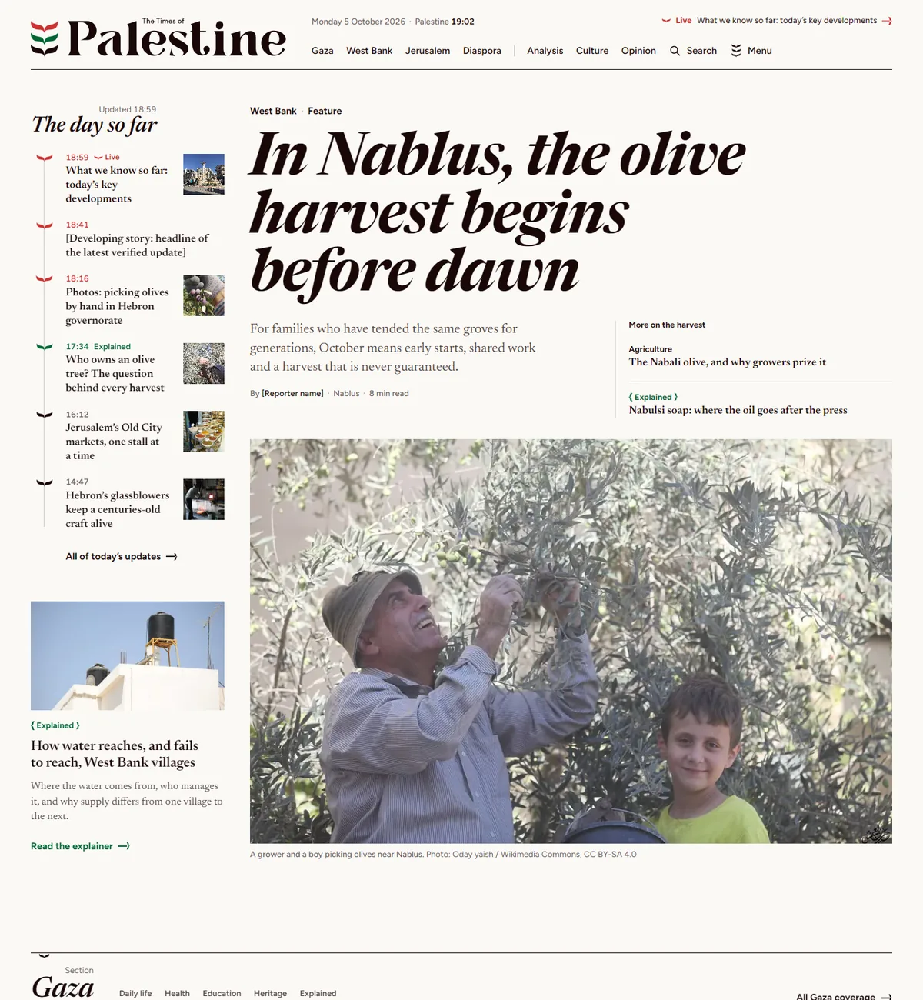
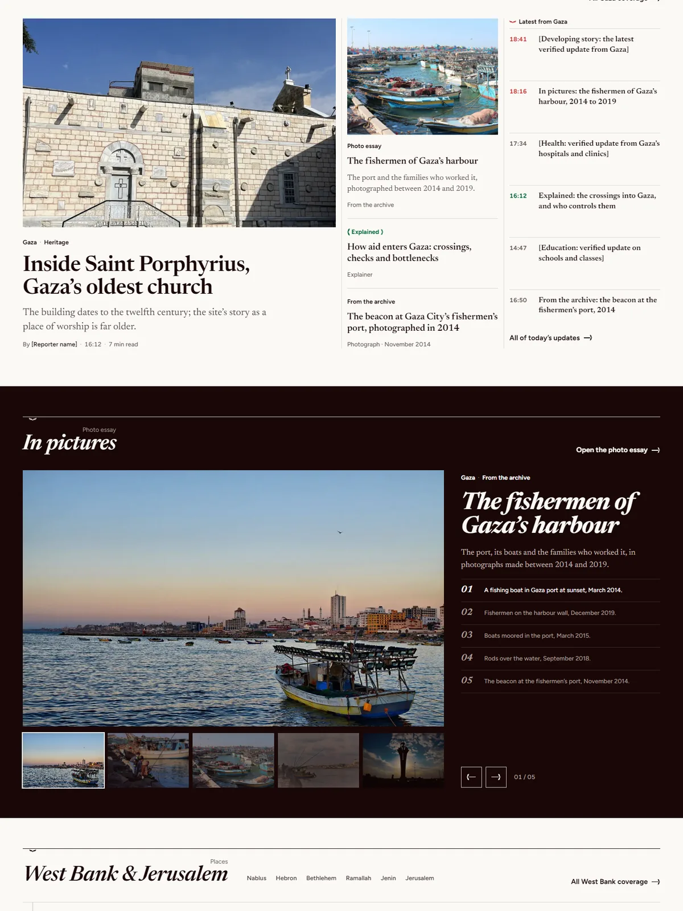
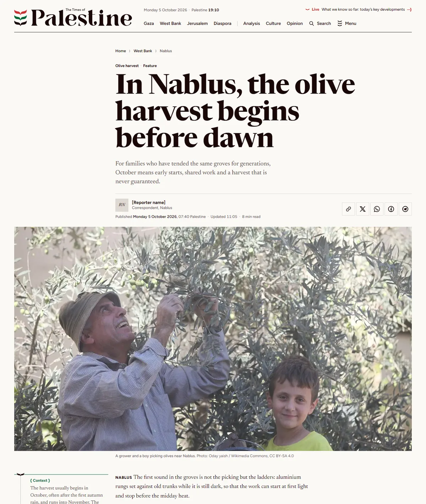
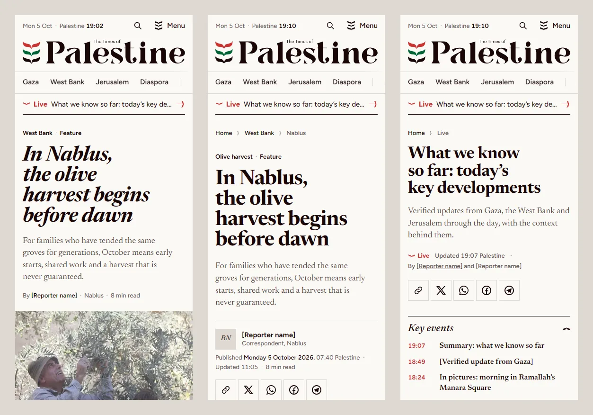

# The Times of Palestine — news theme

English-language news site for **The Times of Palestine** (paltimesnews.com):
news, context and stories from Palestine. Static HTML, CSS and JavaScript with
no framework and no required build step. Open `index.html` through any static
server and it runs.

**Live demo:** <https://taktek-dev.github.io/theme-times-of-palestine/>
(add `?news=breaking` or `?news=calm` to any page to see the header's other moods).
Every template, with a thumbnail, is listed on
[`pages.html`](https://taktek-dev.github.io/theme-times-of-palestine/pages.html).



| | |
| --- | --- |
|  |  |



## Pages

| File | Template |
| --- | --- |
| `index.html` | Home: the lead story's photograph carrying its headline, beside "Today’s updates" at the same height; the Gaza front; West Bank & Jerusalem in the same form as Gaza, with its updates; Solidarity; the context desk (analysis and opinion); most read; the photo gallery last |
| `article.html` | Story: headline, byline and sharing, lead photograph, body on the spine with side notes, pull quote (Arabic and English), step timeline, picture pair, standards note, author box, related stories |
| `live.html` | Live coverage: status, key events (sticky on desktop), updates feed with "new updates" and "older updates", context column |
| `section.html` | Section front (Gaza): giant title, topics, front strip, gallery, two-column archive, most read |
| `author.html` | Reporter profile, latest story as a spread, earlier stories |
| `search.html` | Search results with facets, highlighted terms and a context card |
| `photo-essay.html` | Photo essay on ink: numbered plates in four layouts |
| `about.html` | About, how to read us, standards, corrections, contact |
| `404.html` | Not found, with search and the main sections |
| `opinion.html` | Analysis & opinion front: the context desk on green, columnists, latest pieces beside the letters to the editor, most read |
| `opinion-article.html` | Opinion column: label and column name, italic headline, the writer's byline, green drop cap, opinion note in the rail, standards note, more from the column |
| `writer.html` | Columnist: portrait, column and schedule, the latest column set as a quotation, every column, more columnists |
| `writers.html` | The newsroom: columnists, reporters by bureau on the spine, photographers, editors |
| `tag.html` | Topic: follow button, "the story so far" timeline beside the lead story, all coverage, explainer, related topics |
| `archive.html` | Archive: filters, a month calendar with one bar per day, each day's stories by section |
| `contact.html` | Contact form, the desks, secure tips, bureaus |
| `search-empty.html` | Search with no results: what to try next, sections, latest stories |
| `privacy.html` | Privacy, cookies and terms: contents on the spine that follow the reading, "in short" box |
| `solidarity.html` | Solidarity front: marches, campaigns, statements and official positions; a front strip with its timed list, statements quoted as issued with their source, pictures |
| `explainer.html` | Explainer: the short answer, numbered questions on the left that follow the reading, answers on the spine with steps, a figure and a quote, "what we don't know yet", key words, sources |
| `video.html` | Video front: the lead film on ink with its chapters and what to watch next, a series ("One view of Jerusalem"), every video by place with running times |
| `video-story.html` | Video: the player on ink with a standards note, chapters that jump to their moment, transcript, up next, more from the place |
| `photos.html` | Photography front: the lead essay on ink with its contact strip, photo essays as contact sheets, single frames in justified rows |
| `pages.html` | Theme index: every template with a thumbnail (not linked from the site, `noindex`) |

Every story link in the demo opens the template of its kind: `article.html`
for news and features, `opinion-article.html` for opinion, `explainer.html`
for explainers, `video-story.html` for videos and `photo-essay.html` for photo
essays. Every section link opens `section.html` and topics open `tag.html`, so
each template can be reached from anywhere. Links that differ only by a query
string (`?section=west-bank`, `?tag=nablus`, `?type=analysis`, `?q=…`,
`?date=…`) name the page after the link that was followed and mark it as
current; the sample stories stay the same until a CMS renders each page.

## Run it

```bash
python -m http.server 8000
```

Then open <http://localhost:8000>. Any static host works the same way
(GitHub Pages, Netlify, an S3 bucket, nginx).

## Structure

```
.
├── index.html … pages.html  twenty-four templates (see above)
├── partials/               head.html, header.html, footer.html: the source of truth for shared markup
├── css/
│   ├── fonts.css           @font-face, plus metric-matched fallbacks (no layout shift on swap)
│   ├── tokens.css          colour, type, space and layout tokens
│   ├── base.css            reset, document defaults, motion and print
│   ├── components.css      atoms and shared parts (cards, section heads, tabs, share, pager…)
│   ├── header.css          header, menu, breaking band, condensed bar
│   ├── footer.css          footer
│   ├── core.css            GENERATED: the six files above in one request
│   ├── modules.css         front-page modules (home, section and opinion fronts, author)
│   ├── people.css          columnists, the writer's page, the newsroom
│   └── home.css · article.css · live.css · section.css · author.css · search.css · essay.css · about.css · 404.css
│       · opinion.css · tag.css · archive.css · contact.css · legal.css · theme-index.css
│       · video.css · photos.css · explainer.css · solidarity.css
├── js/main.js              all behaviour, one deferred file, no dependencies
├── fonts/                  Newsreader, Figtree, Markazi Text (woff2, OFL licences alongside)
├── media/                  the sample video (MP4, H.264) and its captions file (a placeholder)
├── docs/                   README images; docs/pages/ holds the theme index thumbnails
├── img/
│   ├── brand/              logo, inverse logo, mark, leaf, braces, ring (SVG)
│   ├── photos/             responsive WebP sets: <name>-<width>.webp
│   ├── icons/              app icons for the manifest
│   └── og/                 1200×630 social cards
├── tools/build.py          builds css/core.css, syncs partials into pages, versions assets, checks links
├── favicon.ico · favicon.svg · apple-touch-icon.png · site.webmanifest
├── robots.txt · sitemap.xml · feed.xml
└── CREDITS.md              photographs, typefaces, identity
```

## Editing

The header, footer and the shared part of `<head>` are written once, in
`partials/`. Each page holds a copy between markers such as
`<!-- tot:header -->` and `<!-- /tot:header -->`. Edit the partial, never the
copy, then run:

```bash
python tools/build.py
```

It rebuilds `css/core.css`, writes the partials into every page, marks links to
the current page with `aria-current="page"` and stamps `?v=N` on every CSS and JS
reference. After any CSS or JS change, raise the version so browsers fetch the
new files:

```bash
python tools/build.py --bump
```

`--check` also reports missing files, duplicate ids and placeholder links.
The tool is standard-library Python 3.8+.

## The identity in code: "Ledger & Leaf"

- **Colour is temperature.** Red `--now` (#CC3333) means live, breaking, the
  last hour; when nothing is live there is no red on the page. Green
  `--context` (#006633) means explainers, analysis, links and focus. Ink
  `--record` (#190707) is the reporting itself. Neutrals are "stone": red and
  green mixed in OKLab, run from paper (#FBF9F6) to ink.
- **One glyph.** A single leaf of the three-leaf mark is the only icon shape:
  arrow head, live pulse, timeline node, breadcrumb separator, the notch in the
  footer, the marker under the current tab. Half a leaf on each side makes the
  braces `{ Explained }` that label context. A ring of leaves marks the
  editorial standards.
- **The spine.** The mark's column is carried down every page
  (`.spine`, `--mark-w`): the day's timeline, the places ledger, the article
  progress leaf and the live feed all hang on it.
- **Type.** Newsreader for headlines and text (roman reports, italic stories
  and section titles), Figtree for the interface, Markazi Text for Arabic.
  Scales in `tokens.css` (`--t-display` 44→92px down to `--t-micro` 12px).
- **The menu is the mark**: three stacked leaves that light up red, green and
  ink on hover and turn into a triskelion when open.
- Photographs stay rectangular and are cropped by ratio only. Only one carries
  text: the home page's lead, whose headline sits on an ink scrim (dense behind
  every line, at least 8:1 contrast) beside "Today’s updates", at its height.

Components answer to their own width through container queries, so the same
markup works in a sidebar, a column or across the page. Breakpoints:
720px (8 columns) and 1100px (12 columns).

## Behaviour (`js/main.js`)

Each part looks for its own markup, so every page loads the same file.

| Hook | What it does |
| --- | --- |
| `[data-now]`, `[data-clock]` | Date and clock in Palestine time (Asia/Hebron), updated on the minute |
| `time[data-ago="N"]` | **Demo only**: sample times written as "N minutes before the page loaded", so the theme always reads as today. A CMS prints real times and drops the attribute |
| `?news=calm\|live\|breaking` | **Demo only**: previews the header's three moods (also `data-news` on `.site-header`) |
| `[data-menu-toggle]` | Opens and closes `#site-menu`; Escape and outside clicks close it; focus returns to the button |
| `.minibar` | The condensed 56px bar once the masthead scrolls away; the menu then hangs under it |
| `[data-gallery]` | Gallery: index, thumbnails, previous/next, arrow keys; pictures come from the JSON in `[data-gal-data]` |
| `[data-live-feed]` | Live page: `[data-new]` updates wait behind "N new updates", `[data-older]` behind "Load older updates"; key events open older updates when needed |
| `[data-copy-link]` | Copies the page address (plus the attribute's fragment, e.g. one live update) and confirms in a toast |
| `[data-share]` | Builds X, WhatsApp, Facebook and Telegram share links from the page being viewed (real links are also in the markup) |
| `[data-newsletter]` | Shows the confirmation in place. **Front end only**: connect the form to the mailing service |
| `[data-contact]` | Contact form: native validation, then the confirmation in place; `?subject=letter` (or any option value) preselects the subject. **Front end only**: connect it to the newsroom inbox |
| `[data-follow]` | Topic follow button (`aria-pressed`); **demo only**, the choice is kept in this browser |
| `[data-toc]` | Contents list: marks the section being read with `aria-current` |
| `[data-player]` | Video: the leaf button plays it, then the browser's own controls take over (without JavaScript the native player shows from the start) |
| `[data-seek]` | Chapters: jump the video named in `data-for` to the chapter's second and mark the chapter being watched; `?t=24` opens a video at 0:24 |
| `?section=` `?tag=` `?type=` `?q=` `?date=` | **Demo only**: the template takes the name of the link that was followed (title, breadcrumb, current tab and menu link). Forms that submit to the page show the choices made |

Without JavaScript every page still reads in full: new and older live updates
are simply shown, and the gallery shows its first picture with its captions.

## Images

Each photograph has WebP files at 160, 320, 640, 800, 960, 1280 and 1600px
(up to its original width). Markup uses `srcset` plus `sizes` written for where
the picture sits. Lazy pictures add `sizes="auto"` so Chromium picks from the
rendered width, except where a picture takes its height from its own
proportions (photo-essay plates, article figures): `auto` adds size containment
there. The lead picture of each template loads eagerly with
`fetchpriority="high"`. `width` and `height` are always set; focal points use
`object-position`.

## SEO and sharing

Every template has a title, description, canonical URL, Open Graph and
Twitter card tags (1200×630 images in `img/og/`) and JSON-LD: `WebSite` with
`SearchAction` and `NewsMediaOrganization` (home), `NewsArticle` (article,
photo essay), `LiveBlogPosting` (live), `CollectionPage` (section),
`ProfilePage` (author), `AboutPage`, `BackgroundNewsArticle` (explainer),
`VideoObject` with its chapters as `Clip`s (video), and `BreadcrumbList` where
there are breadcrumbs. Search and 404 are `noindex`. `sitemap.xml`, `robots.txt` and an
RSS `feed.xml` are included as static samples.

## Accessibility

Landmarks and one `h1` per page, a skip link, visible focus (2px green),
`aria-current` on the current section, labelled controls (labels that are not
shown are visually hidden, never removed), 24px minimum targets, live regions
for the toast and gallery captions, focus moved to revealed live updates, and
`prefers-reduced-motion` respected (the live pulse stops, transitions collapse).

## Checked on 6 October 2026

- **Layout**: all twenty-three templates at 375, 834 and 1440px in Chrome: no
  horizontal overflow, no console errors, no failed requests. The first nine
  match the approved design boards; the others extend the same system.
- **Other engines**: every template at 375 and 1440px in WebKit 26.5 and
  Firefox 153 (Playwright, Windows): no overflow, no errors; the menu, gallery,
  live updates, video playback and chapter seeking work in both. Playwright's
  WebKit on Windows cannot draw variable-font weights (Google's own font files
  included), so type weight in Safari still needs a look on a real device.
- **Behaviour**: 52 scripted checks (menu, condensed bar, gallery, live
  updates, copy and share, newsletter, header moods, search, opinion links,
  topic follow, contact form, contents lists, the demo's query-string links,
  video play, chapters and `?t=`): all pass. Video seeking needs byte-range
  requests, which GitHub Pages and most hosts serve.
- **Accessibility**: axe-core 4.10 (WCAG 2.0, 2.1, 2.2 A and AA, plus best
  practices) on every template at 375 and 1440px, and with the menu open: no
  violations.
- **Markup**: html-validate 9: no errors with the `standard` preset, nor with
  `recommended` (its `no-inline-style` and `long-title` rules off: focal
  points and picture ratios are inline custom properties, and page titles
  carry the site name).
- **Lighthouse 12**, mobile, every template served locally without
  compression: Accessibility 100, Best Practices 100, SEO 100 (69 on the four
  `noindex` pages, by design), Performance 82–94, CLS 0, LCP 2.9–4.1s under
  simulated slow 4G. On the live site, which compresses text: home 83
  (LCP 3.0s), article 91 (LCP 2.9s).

Not checked: Safari on a real iPhone or Mac, screen readers by hand, the
pages behind a real CMS.

## Browser support

Current Chrome, Edge, Safari and Firefox. The layout relies on container
queries, `subgrid`, `:where()`, `inert`, `text-wrap: balance` (enhancement
only) and the individual `translate`/`rotate`/`scale` properties.

## Before launch

- [ ] Replace the placeholders in square brackets (`[Reporter name]`,
      `[Breaking headline…]`, `[newsroom email]`…) and the placeholder links
      (`#instagram`, `#privacy`…); `python tools/build.py --check` lists them
- [ ] Replace the sample photographs (see `CREDITS.md`), or keep their credits
- [ ] Print real times from the CMS and remove `data-ago` (and the `?news=` preview, if wanted)
- [ ] Connect the newsletter form, the contact form and the search page to the backend
- [ ] Replace the sample video in `media/` with the newsroom's own, and write its
      captions (`.vtt`) and transcript
- [ ] Generate `sitemap.xml` and `feed.xml` from the CMS; check the domain in
      `robots.txt`, canonical and `og:url` tags if it changes
- [ ] `404.html` uses root-relative paths so it works at any depth. `BASE_404`
      in `tools/build.py` is `/theme-times-of-palestine/` for the GitHub Pages
      demo: set it to `/` for the production domain and run the tool
- [ ] Point the server's 404 handler at `404.html`

## Credits

Photographs from Wikimedia Commons, typefaces under the SIL Open Font
License: see [`CREDITS.md`](CREDITS.md). The logo and mark belong to The Times
of Palestine.
